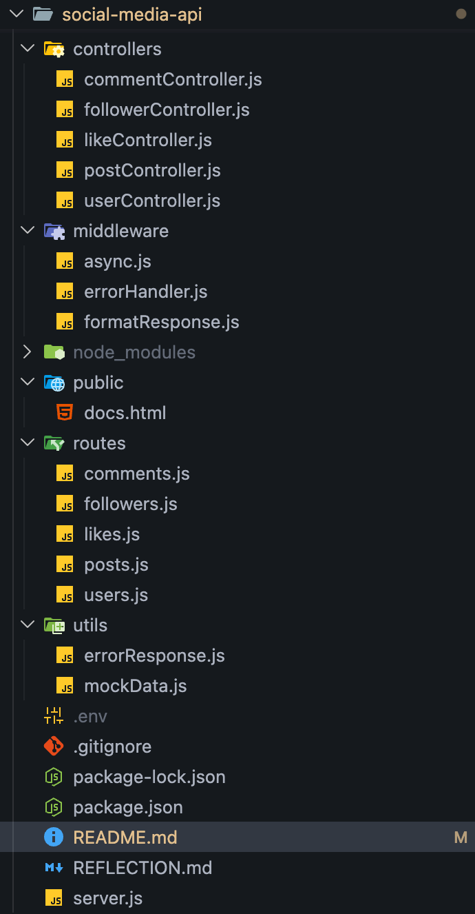

# WEB_102

# Social Media API

A RESTful API for a social media platform built with Node.js and Express.js.

## Tech Stack

- **Node.js** - JavaScript runtime
- **Express.js** - Web framework
- **Morgan** - HTTP request logger
- **Helmet** - Security middleware
- **CORS** - Cross-Origin Resource Sharing
- **Dotenv** - Environment variable management
- **Nodemon** - Development auto-restart

## Project Structure

## Security Features

- **Helmet.js** - Sets various HTTP headers for security
- **CORS** - Controls which domains can access the API
- **Input Validation** - Validates request data before processing
- **Error Handling** - Centralized error handling middleware

